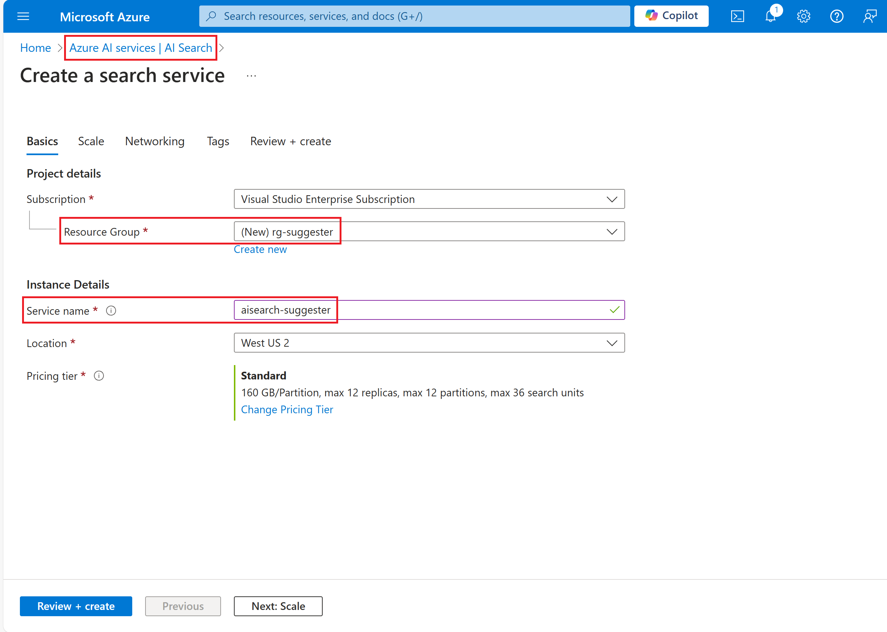
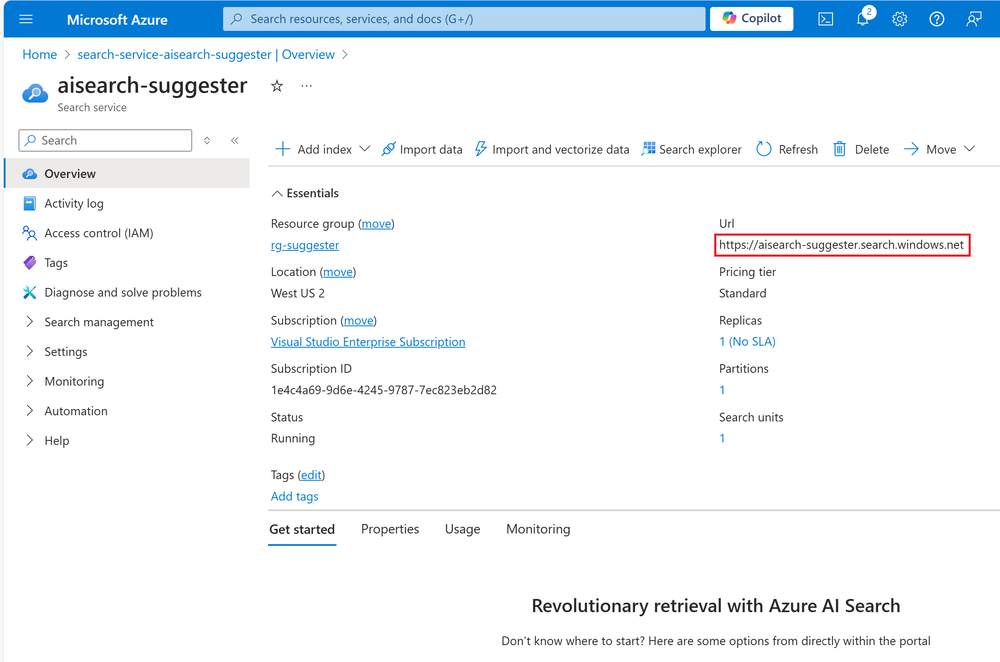
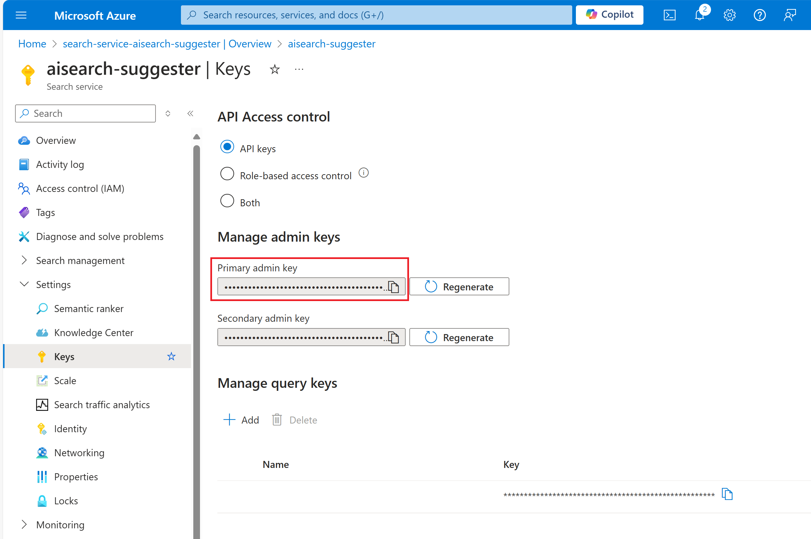
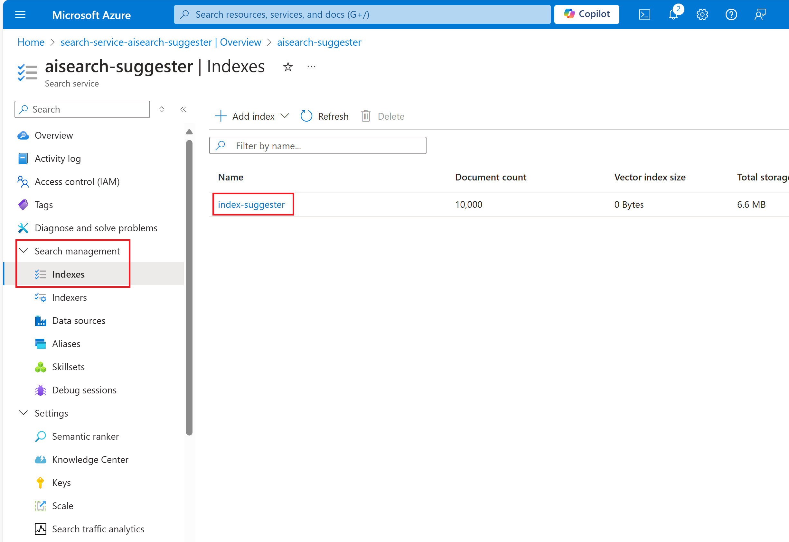
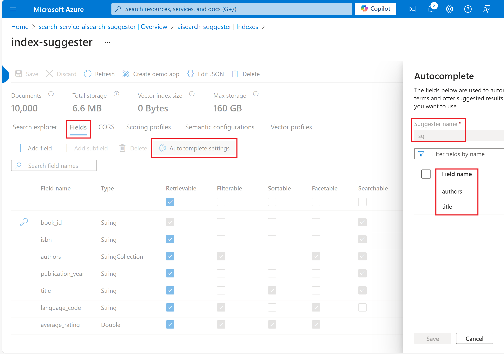

# Suggester with Azure AI Search Service

<!-- vscode-markdown-toc -->
* [What's Suggester?](#WhatsSuggester)
* [Suggester Scenario](#SuggesterScenario)
	* [Autocomplete](#Autocomplete)
	* [Suggestion](#Suggestion)
* [Demo Setup](#DemoSetup)
* [Reference](#Reference)

<!-- vscode-markdown-toc-config
	numbering=false
	autoSave=true
	/vscode-markdown-toc-config -->
<!-- /vscode-markdown-toc -->

## What's Suggester?

Azure AI Search service provides Suggester to support autocomplete and suggestion demand. After adding an index in Azure AI Search service, we can create a Suggester and specify its source fields which are used to automatically complete search terms and offer suggested result. Finally we just upload the data which matches the index schema for further testing.

## Suggester Scenario

### Autocomplete

### Suggestion

## Demo Setup

1. Create an Azure AI Search service

1. Set the values in appsettings.json
    - SEARCH_ENDPOINT
    

    - SEARCH_KEY
    

1. Open IndexService.sln in Visual Studio 2022
1. In Solution Explorer, right click Solution and run the following steps in order
	- Clean Solution
	- Restore Nuget Packages
	- Build Solution
1. Start Debugging IndexService
1. Check the added index and suggester
    - Index
    

    - Suggester
    

## Reference

- [Configure a suggester for autocomplete and suggested matches in a query](https://learn.microsoft.com/en-us/azure/search/index-add-suggesters)
- [Azure AI Search service API documents](https://learn.microsoft.com/en-us/rest/api/searchservice/documents?view=rest-searchservice-2024-05-01-preview)
